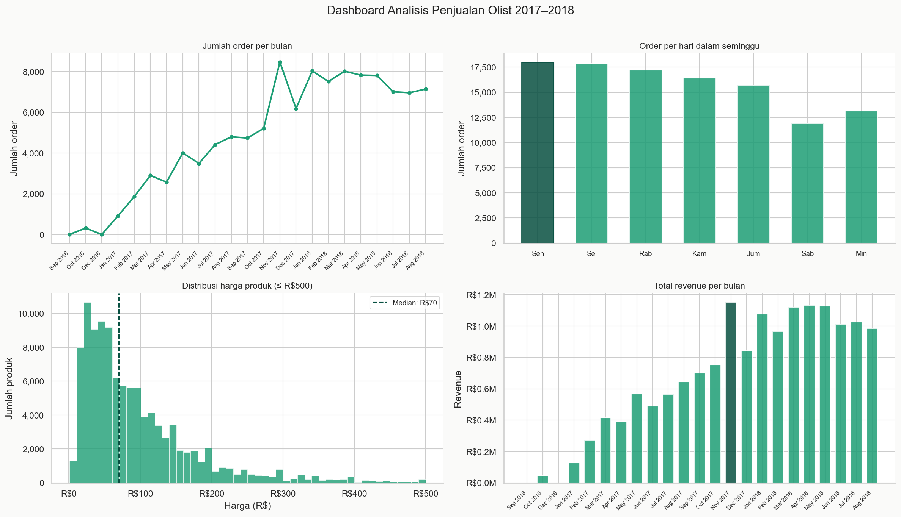
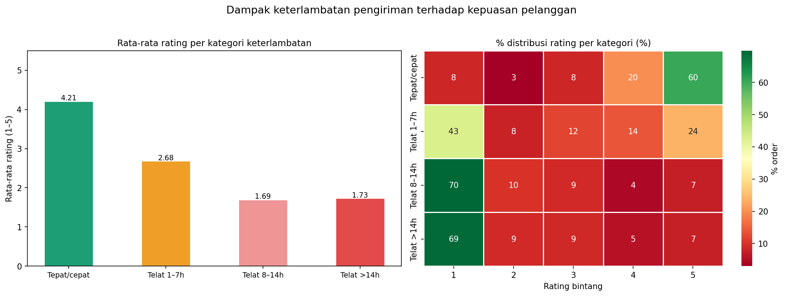
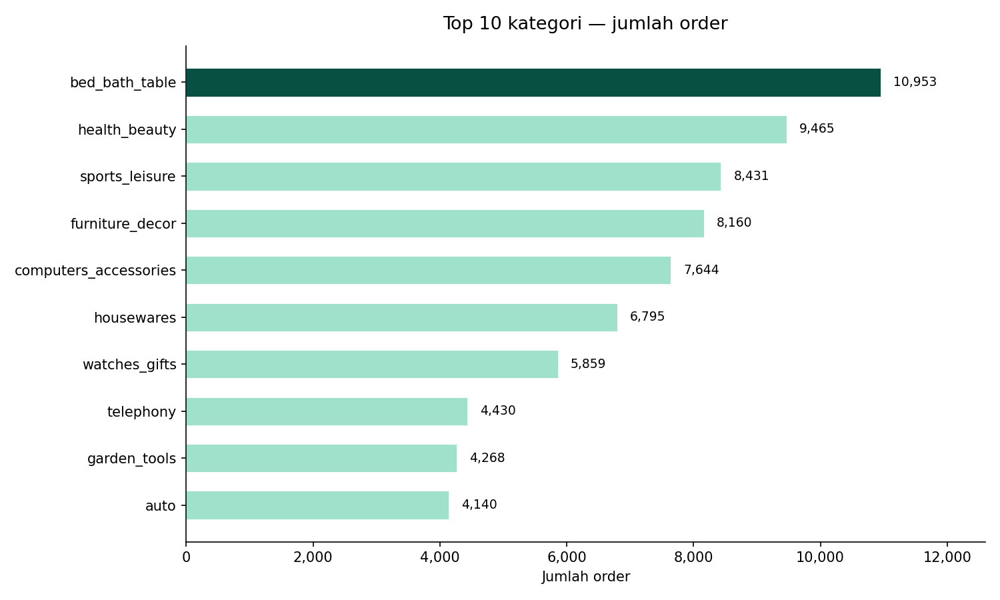

# Analisis Penjualan E-Commerce Olist

Eksplorasi data 100.000+ transaksi e-commerce Brazil (2016–2018)
menggunakan Python dan pandas.

---

## Analisis yang sudah dikerjakan

### 1. EDA penjualan
- Tren jumlah order per bulan
- Order terbanyak di hari kerja (Senin–Rabu)
- Distribusi harga produk — mayoritas di bawah R$150
- Revenue tertinggi di November 2017 (Black Friday)



---

### 2. Kepuasan pelanggan & review
- 76% pelanggan memberi rating 4 atau 5 bintang
- Keterlambatan pengiriman adalah faktor terbesar penurunan rating
- Order telat >14 hari → rata-rata rating turun dari 4.26 ke 1.78 (−58%)



---

### 3. Kategori produk
- Top kategori berdasarkan jumlah order: bed & bath, health & beauty
- Kategori terlaku ≠ kategori revenue tertinggi
- Komputer & elektronik: order sedikit tapi revenue besar



---

## Tech stack
- Python 3.x · pandas · matplotlib · seaborn

## Cara menjalankan
1. Download dataset dari [Kaggle Olist](https://www.kaggle.com/datasets/olistbr/brazilian-ecommerce)
2. Taruh semua file CSV di folder `data/`
3. Jalankan notebook sesuai urutan di folder `notebooks/`

## Struktur folder
​```
project-ecommerce/
├── notebooks/
│   ├── 01-eda-penjualan.ipynb
│   ├── 02-analisis-review.ipynb
│   └── 03-analisis-produk.ipynb
├── output/          # semua grafik hasil analisis
└── README.md
​```