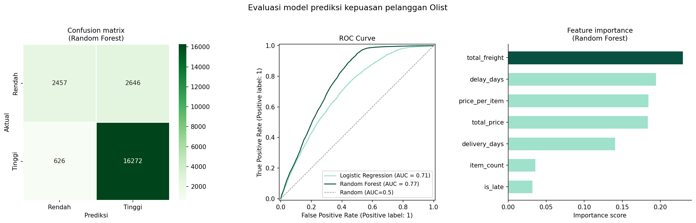
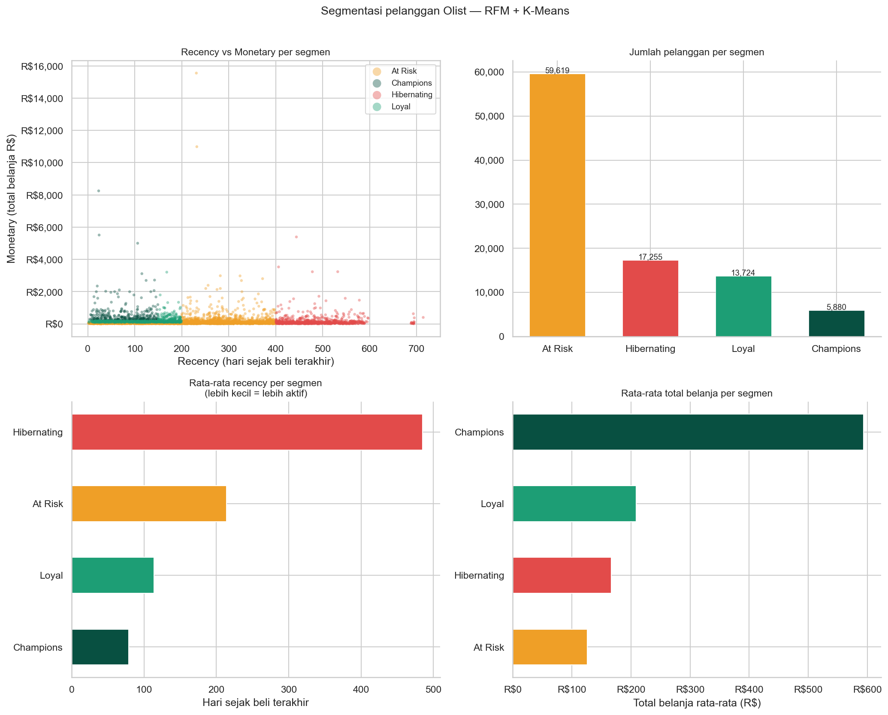

# Analisis Penjualan E-Commerce Olist

Eksplorasi data 100.000+ transaksi e-commerce Brazil (2016–2018)
menggunakan Python dan pandas.

---

## Analisis yang sudah dikerjakan

### 1. EDA penjualan
- Tren jumlah order per bulan
- Order terbanyak di hari kerja (Senin–Rabu)
- Distribusi harga produk — mayoritas di bawah R$150
- Revenue tertinggi di November 2017 (Black Friday)


---

### 2. Kepuasan pelanggan & review
- 76% pelanggan memberi rating 4 atau 5 bintang
- Keterlambatan pengiriman adalah faktor terbesar penurunan rating
- Order telat >14 hari → rata-rata rating turun dari 4.26 ke 1.78 (−58%)


---

### 3. Kategori produk
- Top kategori berdasarkan jumlah order: bed & bath, health & beauty
- Kategori terlaku ≠ kategori revenue tertinggi
- Komputer & elektronik: order sedikit tapi revenue besar


---

### 4. Machine Learning — Prediksi kepuasan pelanggan
- Klasifikasi biner: prediksi apakah pelanggan akan memberi rating tinggi (≥4) atau rendah (≤3)
- Feature engineering dari data order: `delay_days`, `delivery_days`, `is_late`, `total_price`, `total_freight`, `item_count`, `price_per_item`
- Dua model dibandingkan: Logistic Regression vs Random Forest
- `delay_days` dan `is_late` adalah fitur paling dominan — mengkonfirmasi temuan analisis review



---

### 5. Machine Learning — Segmentasi pelanggan RFM
- Mengelompokkan pelanggan ke beberapa segmen menggunakan K-Means clustering
- Dimensi RFM: Recency (kapan terakhir beli), Frequency (seberapa sering), Monetary (total belanja)
- Jumlah cluster optimal ditentukan dengan Elbow method dan Silhouette score
- Segmen hasil clustering: **Champions** · **Loyal** · **At Risk** · **Hibernating**



---

## Tech stack
- Python 3.9.2 · pandas · matplotlib · seaborn · scikit-learn

## Cara menjalankan
1. Download dataset dari [Kaggle Olist](https://www.kaggle.com/datasets/olistbr/brazilian-ecommerce)
2. Taruh semua file CSV di folder `data/`
3. Jalankan notebook sesuai urutan di folder `notebooks/`

## Struktur folder
```
project-ecommerce/
├── notebooks/
│   ├── 00-ringkasan-olist.ipynb
│   ├── 01-eda-penjualan.ipynb
│   ├── 02-analisis-review.ipynb
│   ├── 03-analisis-produk.ipynb
│   ├── 04-ml-prediksi-rating.ipynb
│   └── 05-rfm-clustering.ipynb
├── output/          # semua grafik hasil analisis
└── README.md
```
